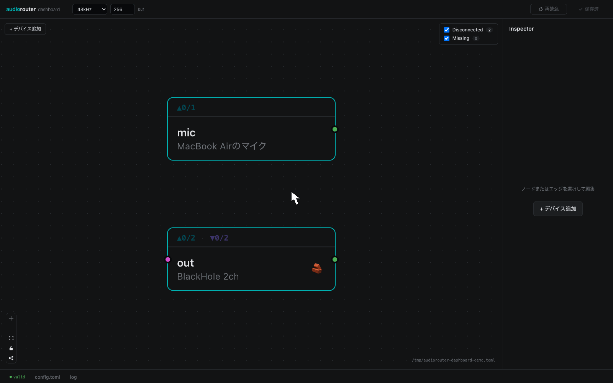

<p align="center">
  
</p>

[](https://crates.io/crates/audiorouter)


`audiorouter` is a cross-platform audio router for mapping, mixing, and monitoring audio channels in real time. It reads a TOML configuration file, opens named audio devices, routes selected input channels to selected output channels, and can be controlled either from a terminal UI or a local web dashboard.

## Features

- Real-time channel remapping and mixing
  - many-to-one, one-to-many, stereo pair routing, mono-to-stereo duplication
- Per-route gain in dB and per-route mute
- Optional per-output peak limiter
- Terminal UI with live meters and a route graph
- Local web dashboard for config editing, validation, device listing, and live events
- Config file watching with live reload
- Audio device polling for connection/default/channel-count changes
- Shell completion generation for Bash, Fish, Zsh, and other `clap_complete` shells
- XDG config path with platform-native fallback

## Installation

```sh
cargo binstall audiorouter
```

Or build from source:

```sh
git clone https://github.com/gw31415/audiorouter.git
cd audiorouter
cargo install --path .
```

> The dashboard frontend is embedded into the Rust binary at build time. Building from source requires Node.js and pnpm unless you are intentionally reusing an existing dashboard build with `SKIP_DASHBOARD_BUILD=1`.

## Quick Start

Find your device names:

```sh
audiorouter list-devices
```

Print the default config location:

```sh
audiorouter config-path
```

Create a TOML config at that path, for example:

```toml
[engine]
sample_rate = 48000
buffer_size = 256

[[devices]]
name = "mic"
device = "MacBook Pro Microphone"

[[devices]]
name = "out"
device = "BlackHole 2ch"
limiter = true

[[routes]]
from = "mic"
to = "out"
from_channels = [1, 1]   # mono → stereo
to_channels   = [1, 2]
gain_db = -6.0
```

Validate the config, then start routing:

```sh
audiorouter check
audiorouter
```

`audiorouter` with no subcommand is equivalent to `audiorouter run`.

## Usage

### `audiorouter --help`

```text
Cross-platform command-line audio router with a terminal UI

Usage: audiorouter [OPTIONS] [COMMAND]

Commands:
  run           Start audio routing (default when no subcommand is given)
  check         Validate configuration and device availability, then exit
  list-devices  List available audio input/output devices, then exit
  config-path   Print the resolved configuration path, then exit
  dashboard     Launch the web dashboard (HTTP/SSE UI) in the default browser
  completions   Generate a shell completion script
  help          Print this message or the help of the given subcommand(s)

Options:
  -c, --config <CONFIG>
          TOML configuration file to read.
          
          If omitted, audiorouter reads the default XDG config path.

  -q, --quiet
          Suppress non-error output

  -v, --verbose...
          Print extra diagnostics. Repeat for more detail.
          
          -v:   debug-level tracing (open/close device, route resolution) -vv:  trace-level (per-callback timing, underrun counts)

  -h, --help
          Print help (see a summary with '-h')

  -V, --version
          Print version
```

### `audiorouter dashboard --help`

```text
Launch the web dashboard (HTTP/SSE UI) in the default browser.

By default the dashboard binds to localhost (127.0.0.1) on port 7822.

Usage: audiorouter dashboard [OPTIONS]

Options:
  -c, --config <CONFIG>
          TOML configuration file to read.
          
          If omitted, audiorouter reads the default XDG config path.

      --host
          Expose the dashboard on the local network (bind 0.0.0.0).
          
          Off by default, which keeps the dashboard reachable only from this machine. Pass `--host` to share it with other devices on the LAN.

  -p, --port <PORT>
          Port to bind the dashboard server on
          
          [default: 7822]

  -q, --quiet
          Suppress non-error output

      --no-open
          Do not open the dashboard in the default browser

  -v, --verbose...
          Print extra diagnostics. Repeat for more detail.
          
          -v:   debug-level tracing (open/close device, route resolution) -vv:  trace-level (per-callback timing, underrun counts)

  -h, --help
          Print help (see a summary with '-h')
```

### `audiorouter completions --help`

```text
Generate a shell completion script.

Writes to stdout by default; use --output to write to a file instead. When no shell is given the current shell is detected from $SHELL.

Usage: audiorouter completions [OPTIONS] [SHELL]

Arguments:
  [SHELL]
          Shell to generate completions for [default: current $SHELL]
          
          [possible values: bash, elvish, fish, powershell, zsh]

Options:
  -c, --config <CONFIG>
          TOML configuration file to read.
          
          If omitted, audiorouter reads the default XDG config path.

  -o, --output <OUTPUT>
          Output file [default: stdout]

  -q, --quiet
          Suppress non-error output

  -v, --verbose...
          Print extra diagnostics. Repeat for more detail.
          
          -v:   debug-level tracing (open/close device, route resolution) -vv:  trace-level (per-callback timing, underrun counts)

  -h, --help
          Print help (see a summary with '-h')
```

### Examples

Use an explicit config file:

```sh
audiorouter --config ./config.toml check
audiorouter run -c ./config.toml
```

Increase diagnostics:

```sh
audiorouter -v check
# -v  = debug-level tracing
# -vv = trace-level diagnostics
```

Generate shell completions:

```sh
# Write to stdout and source immediately (fish example)
audiorouter completions fish | source

# Write to a file
audiorouter completions bash --output ~/.bash_completion.d/audiorouter
```

## Web Dashboard

Launch the built-in dashboard:

```sh
audiorouter dashboard
```

By default it binds to `127.0.0.1:7822` and opens the default browser. Useful options:

```sh
# Do not open a browser
audiorouter dashboard --no-open

# Use a different port
audiorouter dashboard --port 9000

# Expose on the local network by binding 0.0.0.0
audiorouter dashboard --host

# Use a specific config file
audiorouter dashboard --config ./config.toml
```

The dashboard serves the embedded React frontend and an HTTP/SSE API under `/api/*`.

### Dashboard API

The API is primarily for the bundled frontend, but is useful for development and automation:

| Endpoint | Method | Purpose |
|----------|--------|---------|
| `/api/config` | `GET` | Load the current config and raw TOML |
| `/api/config` | `PUT` | Validate and save a config |
| `/api/config/preview` | `POST` | Convert a config JSON payload to TOML without saving |
| `/api/config/status` | `POST` | Return validation state plus dashboard status helpers |
| `/api/validate` | `POST` | Validate config JSON |
| `/api/devices` | `GET` | List available input/output devices |
| `/api/runtime` | `GET` | Return the latest runtime snapshot |
| `/api/events` | `GET` | Server-sent events for config, device, runtime, and log changes |

There is also an API-only development binary:

```sh
cargo run -p audiorouter-dashboard --bin audiorouter-dashboard-api -- --addr 127.0.0.1:7822 --config ./config.toml
```

Environment variables accepted by the dashboard binaries:

| Variable | Default | Purpose |
|----------|---------|---------|
| `AUDIOROUTER_DASHBOARD_ADDR` | `127.0.0.1:7822` | Bind address for dashboard/API server binaries |
| `AUDIOROUTER_CONFIG` | platform config path | Config path used by dashboard/API server binaries |
| `SKIP_DASHBOARD_BUILD` | unset | Set to `1` to skip the frontend build in `build.rs` |

## Configuration

### Configuration Path

Resolution order when `--config` is not provided:

1. `$XDG_CONFIG_HOME/audiorouter/config.toml` — if `XDG_CONFIG_HOME` is set and non-empty
2. `~/.config/audiorouter/config.toml` — if the file already exists there
3. Platform-native config directory:
   - **Linux/BSD** `~/.config/audiorouter/config.toml`
   - **macOS** `~/Library/Application Support/audiorouter/config.toml`
   - **Windows** `%APPDATA%\audiorouter\config.toml`

Print the resolved path for your system:

```sh
audiorouter config-path
```

Relative paths passed with `--config` are resolved against the current working directory.

### Config Reference

#### `[engine]`

| Key | Default | Description |
|-----|---------|-------------|
| `sample_rate` | `48000` | Sample rate in Hz |
| `buffer_size` | `256` | Buffer size in frames |

The entire `[engine]` table is optional. Missing fields use their defaults.

#### `[[devices]]`

| Key | Required | Description |
|-----|----------|-------------|
| `device` | yes | Exact device name as reported by `list-devices` |
| `name` | no | Config-local alias used in routes; defaults to `device` |
| `limiter` | no | Enable peak limiter when this device is used as an output; default `false` |

#### `[[routes]]`

| Key | Required | Description |
|-----|----------|-------------|
| `from` | yes | Source device alias |
| `to` | yes | Destination device alias |
| `from_channels` | yes | 1-based source channel list |
| `to_channels` | yes | 1-based destination channel list |
| `gain_db` | no | Gain in dB; default `0.0` |
| `mute` | no | Mute this route; default `false` |

`from_channels` and `to_channels` must have the same length. Repeat a channel index to duplicate it, for example:

```toml
from_channels = [1, 1]
to_channels   = [1, 2]
```

That maps mono input channel 1 to stereo output channels 1 and 2.

### Larger Example

```toml
[engine]
sample_rate = 48000
buffer_size = 256

[[devices]]
name = "vt4"
device = "VT-4"

[[devices]]
name = "mic"
device = "MacBook Pro Microphone"

[[devices]]
name = "blackhole"
device = "BlackHole 2ch"
limiter = true

[[devices]]
name = "speaker"
device = "MacBook Pro Speakers"

[[routes]]
from = "vt4"
to = "blackhole"
from_channels = [3, 4]
to_channels = [1, 2]
gain_db = 0.0

[[routes]]
from = "mic"
to = "blackhole"
from_channels = [1, 1]
to_channels = [1, 2]
gain_db = -8.0

[[routes]]
from = "vt4"
to = "speaker"
from_channels = [3, 4]
to_channels = [1, 2]
gain_db = -12.0
mute = false
```

## Development

This repository is a Cargo workspace:

- `audiorouter` — CLI, terminal UI, routing runtime
- `crates/audiorouter-core` — shared config, validation, device inventory, watchers, and API DTOs
- `crates/audiorouter-dashboard` — dashboard HTTP/SSE API and embedded frontend host
- `crates/audiorouter-dashboard/dashboard` — React/Vite dashboard frontend

Common Rust commands:

```sh
cargo fmt --all
cargo test --workspace
cargo clippy --workspace --all-targets -- -D warnings
```

Dashboard frontend development:

```sh
cd crates/audiorouter-dashboard/dashboard
pnpm install
pnpm dev
```

`pnpm dev` starts both:

- `audiorouter-dashboard-api` at `AUDIOROUTER_DASHBOARD_ADDR` or `127.0.0.1:7822`
- the Vite dev server, proxying `/api/*` to that API server

Frontend checks:

```sh
cd crates/audiorouter-dashboard/dashboard
pnpm check
pnpm test
pnpm lint
pnpm format
```

Build the embedded dashboard host directly:

```sh
cargo run -p audiorouter-dashboard
```

For pure Rust iterations where a previously built dashboard `dist` can be reused:

```sh
SKIP_DASHBOARD_BUILD=1 cargo test --workspace
```

## Dashboard Demo



## License

Apache License 2.0 — see [LICENSE](LICENSE).
