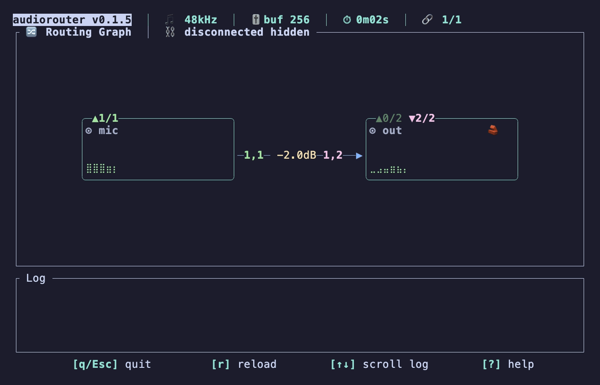

# Introduction

  

**audiorouter** is a cross-platform audio router for mapping, mixing, and
monitoring audio channels in real time. It reads a TOML configuration file,
opens named audio devices, routes selected input channels to selected output
channels, and can be controlled either from a terminal UI or a local web
dashboard.

## Features

- Real-time channel remapping and mixing
  - many-to-one, one-to-many, stereo pair routing, mono-to-stereo duplication
- Per-route gain in dB and per-route mute
- Optional per-output peak limiter
- Terminal UI with live meters and a route graph
- Local web dashboard for config editing, validation, device listing, and live events
- Config file watching with live reload
- Audio device polling for connection/default/channel-count changes
- Shell completion generation for Bash, Fish, Zsh, and other `clap_complete` shells
- XDG config path with platform-native fallback

## Demo

## Links

| Resource | URL |
|----------|-----|
| GitHub | <https://github.com/gw31415/audiorouter> |
| crates.io | <https://crates.io/crates/audiorouter> |
| API documentation | <https://docs.rs/audiorouter> |
| License | Apache License 2.0 |
